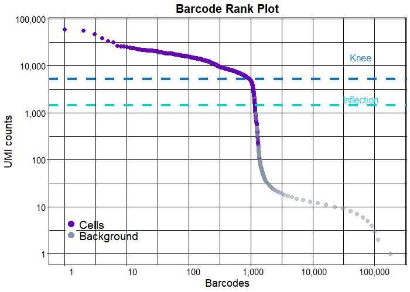

```{r chunk_options, include = FALSE}
knitr::opts_chunk$set(warning=FALSE, message=FALSE)
```

```{r}
library(scRNAseqTemplateR)
library(ggplot2)
library(Seurat)
library(dplyr)
```

# Preliminaries

## Description

### Background

Analysis of the Peripheral blood mononuclear cells (PBMC) dataset
("PBMC_1k v3")

PBMCs are primary cells with relatively small amounts of RNA (\~1pg
RNA/cell).

### Data generation workflow

-   Single-cell instrument:

-   Single-cell genomics library structure:

-   Sequencing machine: [Illumina
    NovaSeq](https://sapac.illumina.com/systems/sequencing-platforms/novaseq.html)

### Data

-   Access: [10x
    genomics](https://www.10xgenomics.com/resources/datasets/1-k-pbm-cs-from-a-healthy-donor-v-3-chemistry-3-standard-3-0-0).
    The 'toy' dataset can be downloaded directly from the 10x genomics
    website. Data was downloaded on 23/02/2022.

-   File format: fastq

-   Reference:

## Directories

-   /scripts contains:
-   /analysis contains: .rmd template files; .html knitr output files;
    .png output plots; .csv results
-   /data contains the raw fastq files and

## Pipeline

kallisto_bustools -> Seurat

### Why Kallisto?

Shainer and Stemmer (2021)

> "Another challenge in scRNA-seq preprocessing is the amount of data
> that must be processed. A single-cell experiment can generate
> 10^6-10^10 reads from 10^3-10^6 cells. This is leading to bottlenecks
> in analysis: for example, the current standard program for
> preprocessing 10x Genomics Chromium scRNA-seq, the Cell Ranger
> software, requires approximately 22h to process 784 million reads
> using 1.5Tb disk space." - Melsted et al., 2021

We have downloaded 6 FASTQ files that are separated into two sequencing
lanes *L001* and *L002*. There are 3 reads (*R1*: barcodes; *R2*: cDNA
sequence; *I1*: Illumina lane info) in each lane.

```{r loadData, include=FALSE}
# Raw count_matrix - Output of Kallisto-bustools
load(file = "../data/raw_matrix.rda")

# Transcript to genes dataframe - Output of Kallisto-bustools
load(file= "../data/tr2g.rda")

# Defining directories

## Kallisto output directory
## This directory contains the output files from the kallisto-bustools pseudoalignment steps, and are stored in inst/extdata
kallisto_path <- '../inst/extdata/output'

## Saving all results
results_path = '../results'

## Saving the filtered matrix in 10x format 
out_path = '../inst/extdata/output_filt/counts_filtered'

```

# Quality Control 

```{r UMIcounts_barcodes}
# Dimensions of matrix
dim(raw_matrix)

# Examining distribution of UMI counts over barcodes
tot_counts <- Matrix::colSums(raw_matrix)
summary(tot_counts)
```
## Quality-control

### Analysis and removal of empty droplets to generate `filt_matrix.rda`. 

1.  Prior to filtering out the empty droplets, we can check which genes
    have the highest proportions in all droplets? [Code adapted from
    Kallisto\|bustools](##%20Adapted%20from%20https://www.kallistobus.tools/tutorials/kb_building_atlas/r/kb_analysis_0_r/)

```{r Plot_genes_proportion}
plot_pct_genes(raw_matrix, tr2g)
class(raw_matrix)
class(tr2g)
```

As expected, the top genes by proportion of all counts are ribosomal or
mitochondrial genes.

2.  Next, we use the `DropletUtils` package to filter away the empty
    droplets [Code adapted from
    DIYtranscriptomics](https://journals.asm.org/doi/10.1128/mBio.01214-21)
    [Vignette on
    DropletUtils](https://bioconductor.org/packages/release/bioc/vignettes/DropletUtils/inst/doc/DropletUtils.html#detecting-empty-droplets)


```{r removeEmpty, results=FALSE}
# Use DropletUtils package to get probability that each barcode is a cell
out <- DropletUtils::emptyDrops(raw_matrix)

# Set threshold probability for calling a cell
keep <- out$FDR <= 0.05 

# Use threshold to remove empty drops
keep[is.na(keep)] <- FALSE
filt_matrix <- raw_matrix[,keep] 

# Dimensions of filtered matrix: 60623 x 1222
head(filt_matrix)

# Proportion of cells kept: Approx 2%
dim(filt_matrix)[2]/dim(raw_matrix)[1]*100

# Keep distinct rows of tr2g

tr2g <- dplyr::distinct(tr2g[, c("gene", "gene_name")])

```

We can then write out the filtered matrix in a 10X format as follows:

```{r write10xcounts_filteredMat }

DropletUtils::write10xCounts(out_path, 
               x = filt_matrix, 
               gene.id = unlist(tr2g[,1]),
               gene.symbol = unlist(tr2g[,2]),
               overwrite=T) 
```

3.  Produce the classic 'knee plot' from [Macosko et al.,
    2015](https://www.cell.com/fulltext/S0092-8674(15)00549-8)
    [functions.R modified from Sarah Ennis
    repo](https://github.com/Sarah145/scRNA_pre_process)
    
First, we load the processed, filtered matrix after removing empty droplets via the `DropletUtils` package.

```{r calculate-stats, results=FALSE}

# Load filtered mtx
#filt_mtx <- Matrix::readMM(paste0(out_path,'/matrix.mtx')) 
load(file="../data/filt_matrix.rda")

# Load run info from JSON files produced by Kb
#kb_stats <- c(fromJSON(file = '../data/output/inspect.json'), 
#              fromJSON(file = '../data/output/run_info.json')) 
load(file = "../data/kb_stats.rda")

# Determine 10x Chromium library prep chemistry version
tech <- grep('10[X/x](.*)', strsplit(kb_stats$call, '\\s')[[1]], value=T) 

# Summarise stats in 'pretty' way
seq_stats <- data.frame(stat = c('Sequencing technology', 
                                 'Number of reads processed', 
                                 '% reads pseudoaligned', 
                                 # get sequencing/alignment stats 
                                 '% reads on whitelist'), 
                        value = prettyNum(c(tech, 
                                kb_stats$n_processed,
                                kb_stats$p_pseudoaligned,
                                round(kb_stats$percentageReadsOnWhitelist,2)), 
                                big.mark = ','))

# Calculate cell stats and save to df
# Total percentage of counts in filtered vs raw mtx
p_cnts_in_cells <- round((sum(filt_matrix)/sum(raw_matrix))*100, 2) 
# Median number of gene counts in cells in filtered matrix
med_cnts_cell <- median(colSums(filt_matrix))
# Median number of genes expressed (>=1 counts) in filtered matrix
med_genes_cell <- median(apply(filt_matrix, 2, function(x) sum(x >= 1)))
# Total number of genes detected
tot_genes_detected <- sum(rowSums(filt_matrix)>=1)

cell_stats <- data.frame(stat = c('Estimated number of cells', 
          '% counts in cells', 
          'Median counts per cell', 
          'Median genes per cell', 
          'Total genes detected'), 
          value = prettyNum(c(ncol(filt_matrix), p_cnts_in_cells, med_cnts_cell,
          med_genes_cell, tot_genes_detected), big.mark = ','))

# Get rank stats and save
stats <- DropletUtils::barcodeRanks(raw_matrix)

#write.table(stats, file=paste0(out_path, "/barcode_rank.txt"))

```


```{r knee-plot}
# load raw cells
#raw_cells <- read.table(paste0(kallisto_path,'/counts_unfiltered/cells_x_genes.barcodes.txt'),header=FALSE)[,1] 
load(file="../data/raw_cells.rda")

# load filtered cells
#filt_cells <- read.csv(paste0(out_path, "/barcodes.tsv"), header = F, sep ='\t')[,1] 
load(file="../data/filt_cells.rda")

# create barcode rank plot and save as .png
bc_rank_plot(stats = stats, raw_cells = raw_cells, filt_cells = filt_cells, 
             save = paste0(results_path,"/plots/barcode_rank.png"))

# output a HTML summary of the run for presentation. 
print_HTML(seq_stats = seq_stats, cell_stats = cell_stats, 
          dir = "./", img_dir = paste0(results_path,"/plots/"), sample_id = NULL)

```

{width = 50%}

After this point, the data is analysed within Seurat with the standard
workflow.

### Extra QC plots

Create a Seurat object and use it to plot several other QC diagnostics.

```{r createSeuratObject, eval = FALSE}
# Create expression matrix with Read10X function from Seurat
# out_path contains the genes.tsv, barcodes.tsv and matrix.mtx files
# gene.column = 2 means we use the gene_symbols (not the ensembl IDs) for gene names

expression_matrix <- Read10X(
  out_path,
  gene.column = 2,
  cell.column = 1,
  unique.features = TRUE
)

# Create Seurat object
pbmc.1k.seurat <- CreateSeuratObject(counts = expression_matrix, 
                                     project = "pbmc1k",
                                     min.cells = 3,
                                     min.features = 200)

```

```{r load_from_data, include=FALSE}

load(file = "../data/pbmc.1k.seurat.rda")

```


1.  Calculate percent of mitochondrial reads, RNA counts and feature
    counts

```{r, QC_pert_Mito}
# Stash the percent.mt stats in seurat object metadata
# NOTE: Change 'MT' to 'mt' for mouse
pbmc.1k.seurat[["percent.mt"]] <- Seurat::PercentageFeatureSet(object = pbmc.1k.seurat, pattern = "^MT") 

# Violin plots of the 3 QC metrics
Seurat::VlnPlot(pbmc.1k.seurat, c("nCount_RNA", "nFeature_RNA", "percent.mt"), 
        pt.size = 0.1, ncol=3)
```


2.  Relationship between percentage of mitochondrial reads / number of
    detected genes and the total UMI counts per cell

**Analysis of #Detected genes vs total UMI counts**:

1.  Data points in the bottom left hand quadrant = low genes and UMIs
    per cell. May represent poor quality cells.

2.  Data points in the bottom RIGHT hand quadrant = low genes but high
    UMIs per cell. These could be dying cells, but also could represent
    a population of a low complexity cell type (i.e red blood cells).

**Analysis of %mito vs total UMI counts**:

For high quality cells, we expect there to be low % mitochondrial reads
for cells with higher UMI counts.

```{r, QC_scatter_genes_mito}

p1 <- ggplot(pbmc.1k.seurat@meta.data, aes(nCount_RNA, nFeature_RNA)) +
  geom_point(alpha = 0.7, size = 0.5) +
  labs(x = "Total UMI counts per cell", y = "Number of genes detected")+
  theme_minimal()

p2 <- ggplot(pbmc.1k.seurat@meta.data, aes(nCount_RNA, percent.mt)) +
  geom_point(alpha = 0.7, size = 0.5) +
  labs(x = "Total UMI counts per cell", y = "Percentage of mitochondrial genes")+
  theme_minimal()

# 1x2 layout
gridExtra::grid.arrange(p1, p2, ncol=2)

```

Following examination of the QC metrics, we further subset the
SeuratObject to retain only the high-quality cells.

```{r subset_seurat}
pbmc.1k.seurat <-subset(pbmc.1k.seurat, subset = 
                           nCount_RNA < 20000 & 
                           nCount_RNA > 1000 & 
                           nFeature_RNA > 1000 & 
                           percent.mt < 20)

pbmc.1k.seurat
```

From the initial Seurat Object of 1206 cells (after removal of empty
droplets), we are now left with 1064 cells for downstream analysis.

## Normalisation and dimensional reduction

We apply the following list of functions in sequence:

`pbmc.1k.seurat.2`
- `NormalizeData`:

`pbmc.1k.seurat.3`
- `FindVariableFeatures`: 

`pbmc.1k.seurat.4`
- `ScaleData`: standardise gene expression to have mean =0; variance = 1. This 
givers equal weight to all genes in downstream analysis, preventing 
highly-expressed genes from dominating the analysis.
- `RunPCA`:

`pbmc.1k.seurat.5`
- `FindNeighbors`:
- `FindClusters`: 

`pbmc.1k.seurat.6`
- `RunUMAP`:

First, we observe how our QC and normalisation procedure affects the most highly-expressed genes.

```{r QC_top_n_counts}
verbose = TRUE
pbmc.1k.seurat.2 <- pbmc.1k.seurat %>%
  NormalizeData(verbose = verbose) 

plot_pct_genes(GetAssayData(pbmc.1k.seurat.2, slot = "counts"), 
               tr2g, symbol = "symbol")
```

Next, we identify the top 2000 most highly variable genes

```{r top2k_var_genes}
pbmc.1k.seurat.3 <- pbmc.1k.seurat.2 %>%
  FindVariableFeatures(verbose = verbose) 

# Identify the 10 most highly variable genes
top10 <- head(VariableFeatures(pbmc.1k.seurat.3), 10)

# plot variable features with and without labels
plot1 <- VariableFeaturePlot(pbmc.1k.seurat.3, log = FALSE)
LabelPoints(plot = plot1, points = top10, repel = TRUE)

```

Next, we scale and perform PCA analysis.

Here, we first visualise the PCA loadings for the genes in the first 2 PCs.

```{r scale_pca, fig.width = 7, fig.height = 5}
pbmc.1k.seurat.4 <- pbmc.1k.seurat.3 %>%
  ScaleData(verbose = verbose) %>%
  RunPCA(npcs = 40, verbose = verbose) 

VizDimLoadings(pbmc.1k.seurat.4, dims= 1:2, reduction = "pca")
```
We obtain a set of genes that influences the top 2 PCs, which should be relevant
to the biological process at hand.

Next, we can also visualise the expression of a gene using FeaturePlots

```{r visualise_gene}
FeaturePlot(pbmc.1k.seurat.4, reduction = "pca", feature = "CST3")
```

We observe that CST3 is highly expressed within a tight cluster of the PCA plot.

Finally, we can assess the dimensionality of the dataset in an `ElbowPlot`.

```{r elbowplot}
ElbowPlot(pbmc.1k.seurat.4)
```
For this dataset, we observe that most of the true signal is captured in the
first 10 PCs. Therefore, for downstream analysis, we only keep the first
10 dimensions.

Next, we find clusters using the louvain algorithm on the PCA embedding

```{r louvain_clustering}
pbmc.1k.seurat.5<- pbmc.1k.seurat.4 %>%
    FindNeighbors(reduction = "pca", dims = 1:10, verbose = verbose) %>% 
    FindClusters(resolution = 0.5, verbose = verbose)
```

Finally, we visualise the clusters in our data with the UMAP embedding.

```{r umap_embedding}
pbmc.1k.seurat.6<- pbmc.1k.seurat.5 %>%
  RunUMAP(reduction = "pca", dims = 1:10, verbose = verbose)

DimPlot(pbmc.1k.seurat.6, reduction = "umap", split.by = "orig.ident", label = TRUE)

```

We visualise the expression of genes of interest in the UMAP

```{r umap_gene_expression, fig.width = 10, fig.height = 5}
FeaturePlot(pbmc.1k.seurat.6, reduction = "umap", features = c("CST3", "NKG7", "PPBP"),
ncol = 3)
```

# Finding cluster-specific marker genes

## Top_n Marker genes for 1 specific cluster

```{r findmarkers}
top_n = 20
cluster1.markers <- FindMarkers(pbmc.1k.seurat.6, ident.1 = 1, min.pct = 0.25)
cluster1.markers$pct.diff <- cluster1.markers$pct.1 - cluster1.markers$pct.2
cluster1.markers.df <- as_tibble(cluster1.markers, rownames = "geneID")

# Export DEGs for each cluster (ranked by avg_logFC > 0.5)
myTopHits_cluster1 <- cluster1.markers.df %>% arrange(desc(avg_log2FC))
myTopHits_cluster1 <- dplyr::slice(myTopHits_cluster1, 1:top_n)

# Interactive table 
DT::datatable(myTopHits_cluster1, 
          extensions = c('KeyTable', "FixedHeader"), 
          caption = 'Table 1: Cluster 1 genes',
          options = list(keys = TRUE, searchHighlight = TRUE, 
                         pageLength = 10, 
                         lengthMenu = c("10", "25", "50", "100"))) %>%
  DT::formatRound(columns=c(2:11), digits=2)
```

## Top 3 Marker genes for all clusters

```{r findallmarkers, fig.width = 8, fig.height = 10}
pbmc.1k.markers <- FindAllMarkers(pbmc.1k.seurat.6, 
                                  only.pos = TRUE, 
                                  min.pct = 0.25, 
                                  logfc.threshold = 0.25)

# Top 10 marker genes for each cluster and plot as a heatmap
top3 <- pbmc.1k.markers %>% 
  group_by(cluster) %>%
  top_n(n = 3, wt = avg_log2FC)

DoHeatmap(pbmc.1k.seurat.6, features = top3$gene)
```

## Export marker genes as .csv

```{r export_markers}
filename = paste0(results_path,"/markers_all.csv")
write.csv(pbmc.1k.markers %>% group_by(cluster), file=filename)

```

## Visualise marker gene expression

### UMAP
```{r featuremap_allmarkers, fig.width = 15, fig.height = 10}

FeaturePlot(pbmc.1k.seurat.6, features = top3$gene, ncol = 5)

```

### Violin plots
```{r violinplots_allmarkers, fig.width = 15, fig.height = 10}

VlnPlot(pbmc.1k.seurat.6, features = top3$gene, ncol = 5)

```

# Assigning identities to clusters

## Manual/de novo annotation approach

First, we visualise a dotplot to facilitate the mapping of cluster identities
using the markers.

```{r dotplot_manualAnnotate}

DotPlot(pbmc.1k.seurat.6, assay = "RNA", features = top3$gene, scale.by = "size") +
  coord_flip()

```

```{r umap_with_ident}

new.cluster.ids <- c("CD14+ Mono", "Memory CD4 T", "Naive CD4 T", "B1", "FCGR3A+ Mono", 
    "NK", "CD8+ T", "B2", "Platelet")
names(new.cluster.ids) <- levels(pbmc.1k.seurat.6)
pbmc.1k.seurat.6 <- RenameIdents(pbmc.1k.seurat.6, new.cluster.ids)
DimPlot(pbmc.1k.seurat.6, reduction = "umap", label = TRUE, pt.size = 0.5, label.size = 4)

```

## Automated annotation approach

*Using the singleR package*

The singleR package labels clusters using public datasets, and is used 
in conjunction with the celldex package. Here, we import only the MonacoImmuneData public dataset which contains curated cell type labels from 114 bulk RNA-seq samples of sorted immune cell populations. 

Generating predictions with singleR
```{r singleR_heatmap}

Monaco.data <- celldex::MonacoImmuneData(ensembl = FALSE) 

# Converting from seuratobject to singlecellexperiment container
pbmc.1k.sce <- as.SingleCellExperiment(pbmc.1k.seurat.6)

# Leverage the Monaco dataset for prediction
# Can change the ref data to annotate with different datasets

predictions <- SingleR::SingleR(test=pbmc.1k.sce, assay.type.test=1, 
                       ref=Monaco.data, labels=Monaco.data$label.main)

SingleR::plotScoreHeatmap(predictions)
```

```{r singleR_predictions, fig.width = 8, fig.height = 6}

#Add prediction labels back to singleCellExperiment object
pbmc.1k.sce[["SingleR.labels"]] <- predictions$labels

#Convert back to seurat object to utilise the seurat dimPlot function
pbmc.1k.seurat.7 <- CreateSeuratObject(counts = pbmc.1k.sce@assays@data@listData[["counts"]],
                                       meta.data = as.data.frame(colData(pbmc.1k.sce)),
                                       reduction = pbmc.1k.sce@int_colData$reducedDims$UMAP)

pbmc.1k.seurat.7[["UMAP"]] <- CreateDimReducObject(embeddings = pbmc.1k.sce@int_colData$reducedDims$UMAP, assay = DefaultAssay(pbmc.1k.seurat.7))

#Plot UMAP
DimPlot(pbmc.1k.seurat.7, reduction = "UMAP", 
        group.by = "SingleR.labels", 
        label = TRUE,
        repel = TRUE)+ 
  patchwork::plot_annotation(title = 'Labelling clusters with singleR labels')+
  theme(plot.title = element_blank())

```

# Conclusions

* Data quality:
- QC analysis shows that cells are of high-quality.
- No other concern.

* Analysis results:
- Identified marker genes for clusters and exported as `r filename`.
- Automated identification of clusters in dataset

# Main packages used:

* Pseudoalignment and transcript quantification: [kallisto\|bustools workflow: Melsted et al.,2021](https://www.nature.com/articles/s41587-021-00870-2) 

* [kallisto: Bray et al., 2016](https://www.nature.com/articles/nbt.3519)

* General single-cell RNA sequencing processing [Seurat 4.0](https://linkinghub.elsevier.com/retrieve/pii/S0092867421005833)

* Automated annotation of cell clusters [singleR](https://www.nature.com/articles/s41590-018-0276-y)


# Session info

```{r session info, include=TRUE}
sessionInfo()
```
